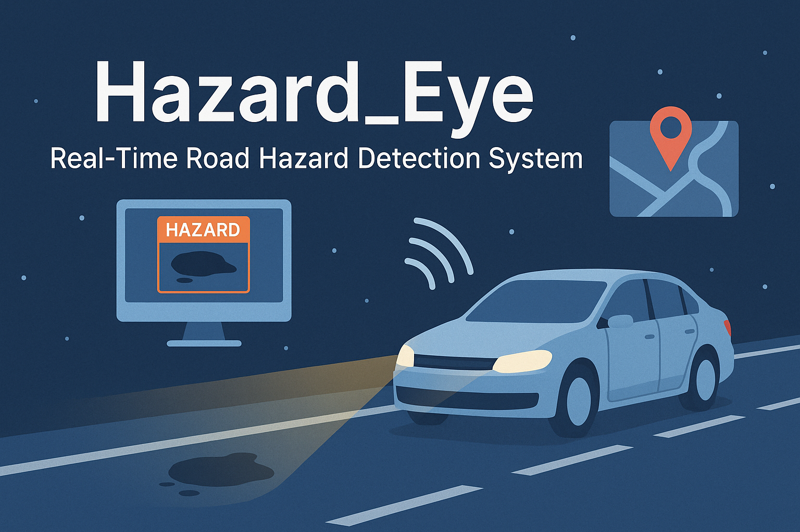

# 🚧 Hazard_Eye – Real-Time Road Hazard Detection System

Hazard_Eye is a smart road safety system that detects real-time hazards such as potholes, speed bumps, and animals using computer vision. It integrates AI with modern web technologies to alert users and auto-report danger zones to local authorities. Designed for smart cities and intelligent transport systems, this project leverages FastAPI, React.js, and YOLOv12.

---



---

## 🧠 Overview

- **Live Hazard Detection** using YOLOv12
- **Real-time Alerts** through UI and automated notifications
- **Smart Braking Simulation** logic based on object proximity
- **Map Integration** using OpenStreetMap (Leaflet.js) to visualize hazard zones
- **Automated Reporting** with email alerts and geo-tagged locations

---

## 🔧 Tech Stack

| Layer       | Technology                        |
|-------------|-----------------------------------|
| Frontend    | React.js, HTML, CSS, JavaScript   |
| Backend     | FastAPI (Python)                  |
| AI Model    | YOLOv12 (PyTorch)                  |
| Mapping     | OpenStreetMap (Leaflet.js)       |
| Deployment  | Uvicorn, GitHub, Localhost        |
| Extras      | SMTP Email, Geolocation, JSON APIs|

---

## 📁 Project Structure

```bash
Hazard_Eye/
├── backend/
│   ├── main.py              # FastAPI server logic
│   ├── detect.py            # Object detection integration
│   ├── utils/               # Helper methods
│   └── config.py            # API keys, credentials
├── frontend/
│   ├── src/
│   │   ├── components/      # UI components
│   │   ├── pages/           # Views
│   │   └── App.js           # Main app logic
├── media/                   # Screenshots / video samples
├── assets/                  # Images, banner, icons
├── README.md
└── requirements.txt
```

---

## 🚀 Getting Started

### 🛠 Prerequisites

- Python 3.8+
- Node.js 18+
- npm or yarn
- Git

---

### 📌 Installation Steps

#### 1️⃣ Clone the Repository

```bash
git clone 
cd 
```

#### 2️⃣ Setup Backend (FastAPI)

```bash
cd backend/
pip install -r requirements.txt
uvicorn main:app --reload
```

#### 3️⃣ Setup Frontend (React)

```bash
cd frontend/
npm install
npm start
```

Once both servers are running, access the application at:  
👉 **http://localhost:51730**

---

## 📬 Email Alert System

- Configure sender credentials in `backend/config.py`
- Automatically sends an email when a hazard is detected
- Includes hazard type, timestamp, and geo-coordinates
- Can be extended to government alert/reporting systems

---

## 🌍 Map Visualization

- Uses **OpenStreetMap** with **Leaflet.js** (free and open-source)
- Plots hazard zones dynamically based on detection
- Real-time and interactive map view on frontend
- Heatmap visualization for high-risk areas
- No API key required - completely free to use

---

## 📊 Key Results

- 🚧 95%+ detection accuracy using YOLOv12
- ⚠️ 70% faster hazard response simulation
- 📤 80% reduction in manual reporting efforts
- 📍 Over 10 zones mapped using OpenStreetMap

---


## 📦 Future Improvements

- ✅ Mobile responsiveness for dashboard
- ✅ Firebase or MongoDB integration for hazard logs
- ✅ Real-time voice alert system
- ✅ Integration with civic/government reporting APIs
# VolkswagenDasAuto
